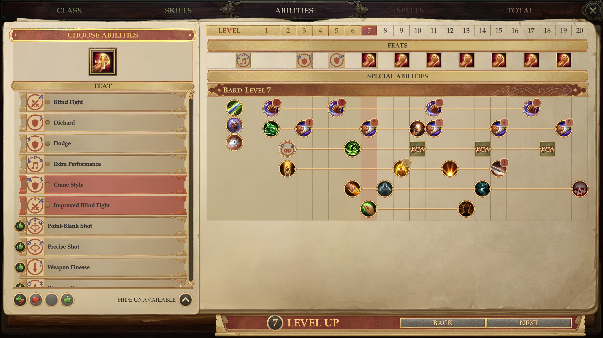

# Summary

This mod allows you to designate favorite feats per character in Pathfinder: Kingmaker. 
It's intended to help with remembering which feats you plan to take for characters to avoid re-evaluating all feats on each level up.

# Installation

Use Unity Mod Manager to install the mod, like any other Kingmaker mod. Just open the zip file with UMM and it will install.

# Basic Usage

**Be sure to read the next few bullet points, or else you'll run into some issues using the mod.** Sorry for some of the usability issues - I'm not sure how to resolve these easily with some modding limitations.

- You can't use this on the initial level 1 character creation screen. You can use it once a character is leveling up to level 2 or above. 
The feats you favorite at level 1 won't be saved, because the character doesn't have a name associated to it yet.
- To toggle the favorite status of a feat, middle click the feat name. You'll hear a sound effect if successful.
- You won't see the favorite status update immediately. After favoriting a feat, wait a few seconds and click another feat or two, and the favorite status of feats will be updated.
The sorting of feats based on favorite status won't be updated until you exit the level up screen and re-enter. Favorited feats will have a marker next to the feat icon.
- Note that you can favorite feats you don't qualify for yet. They'll appear at the top of your feats list to remind you of the feats you need to get prerequisites for.
- You need to have "Show unavailable" selected for these to appear.

# Further Usage Notes

- This mod does not affect your save files. It's safe to install and uninstall during a playthrough.
- Saves are by character name, so NPCs such as Linzi will share their favorite feats across your different playthroughs. 
If you don't want this, you can keep multiple save files for NPCs in different playthroughs by handling the save files yourself - just look in the mod folder for save files like `v1-Linzi.json` and create backups as you like.

# Links

- Github source code: https://github.com/stevejackson/FavoriteFeats_Kingmaker
- Github mod download: https://github.com/stevejackson/FavoriteFeats_Kingmaker/releases
- Nexus: https://www.nexusmods.com/pathfinderkingmaker/mods/334
